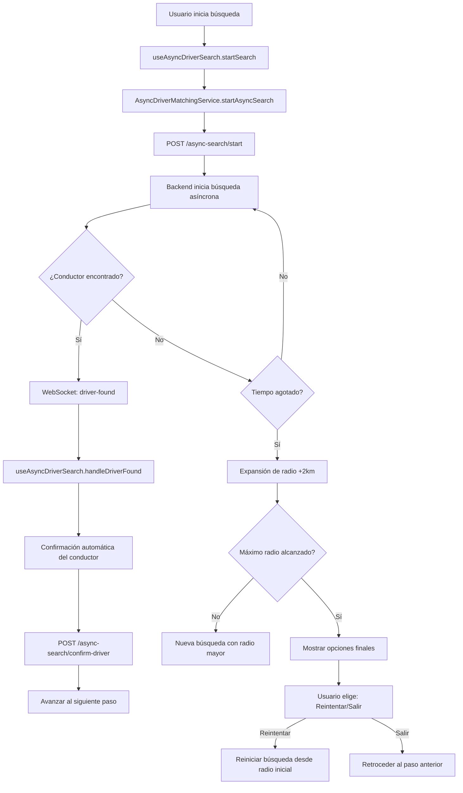

# 🚀 Sistema de Matching Asíncrono - Uber Clone

## 📋 Resumen Ejecutivo

El **Sistema de Matching Asíncrono** representa una evolución significativa en la experiencia de usuario de la plataforma Uber Clone. Este sistema reemplaza el modelo síncrono limitado (que esperaba una respuesta inmediata) por un modelo moderno que mantiene búsquedas activas por varios minutos, proporcionando notificaciones en tiempo real cuando se encuentra un conductor disponible.

### 🎯 Problema Solucionado

**Antes (Sistema Síncrono):**
- ❌ Usuario espera 30 segundos fijos
- ❌ Si no hay conductor → Error inmediato
- ❌ Estado obsoleto al instante
- ❌ Race conditions entre búsquedas
- ❌ Esperas frustrantes para usuarios

**Ahora (Sistema Asíncrono):**
- ✅ Búsqueda activa hasta 5 minutos
- ✅ Expansión automática de radio (2km cada intento)
- ✅ Notificaciones WebSocket en tiempo real
- ✅ Confirmación automática de conductores
- ✅ Opciones finales cuando no se encuentra conductor

---

## 🏗️ Arquitectura del Sistema

### Componentes Principales

```
📁 app/services/asyncDriverMatchingService.ts
├── Clase AsyncDriverMatchingService (Singleton)
├── Interfaces TypeScript completas
├── Métodos: startAsyncSearch, getSearchStatus, cancelSearch, confirmDriver
└── Configuración del sistema (radios, prioridades, timeouts)

📁 lib/websocket/matchingEvents.ts
├── Conexión WebSocket con autenticación JWT
├── Handlers para eventos: driver-found, search-timeout, search-cancelled
├── Gestión de estado de conexión y reconexión automática
└── Utilidades de notificación y manejo de errores

📁 hooks/useAsyncDriverSearch.ts
├── Hook personalizado para gestión de estado de búsqueda
├── Estados: idle, searching, found, timeout, cancelled
├── Métodos: startSearch, cancelSearch, confirmDriver, retrySearch
└── Integración completa con WebSocket y store

📁 store/mapFlow/mapFlow.ts (extendido)
├── Estado asyncSearch agregado al MapFlowState
├── Acciones: startAsyncSearch, updateAsyncSearchStatus, cancelAsyncSearch, confirmAsyncDriver
├── Lógica de tiempo restante con timer automático
└── Helper methods para cálculo de tiempo y gestión de estado

📁 components/unified-flow/steps/Client/Viaje/DriverMatching.tsx (actualizado)
├── Reemplazo completo del sistema síncrono por asíncrono
├── Expansión automática de radio (2km cada timeout)
├── UI de opciones finales (Reintentar/Salir)
├── Indicadores visuales de estado WebSocket
└── Confirmación automática de conductores encontrados
```

### Flujo de Datos



---

## 🔄 Flujo de Búsqueda Asíncrona

### 1. Inicio de Búsqueda
```typescript
// Usuario selecciona origen, destino y tier
const searchParams = {
  lat: userLocation.latitude,
  lng: userLocation.longitude,
  tierId: selectedTier.id,
  radiusKm: 5, // Radio inicial
  priority: 'normal',
  maxWaitTime: 300 // 5 minutos
};

// Iniciar búsqueda asíncrona
const response = await asyncDriverMatchingService.startAsyncSearch(searchParams);
```

### 2. Estados de Búsqueda

| Estado | Descripción | Acción del Sistema |
|--------|-------------|-------------------|
| `idle` | Estado inicial, sin búsqueda activa | Espera inicio de búsqueda |
| `searching` | Búsqueda activa en backend | Timer corriendo, WebSocket conectado |
| `found` | Conductor encontrado vía WebSocket | Confirmación automática, avance al siguiente paso |
| `timeout` | Tiempo agotado sin encontrar conductor | Expansión de radio o opciones finales |
| `cancelled` | Búsqueda cancelada por usuario | Cleanup y vuelta al paso anterior |

### 3. Expansión Automática de Radio

```typescript
const MAX_RADIUS = 20; // km
const RADIUS_INCREMENT = 2; // km por expansión
const MAX_RETRIES = 5;

if (retryCount < MAX_RETRIES) {
  const newRadius = Math.min(currentRadius + RADIUS_INCREMENT, MAX_RADIUS);
  // Reiniciar búsqueda con radio mayor
  await startSearch({ radiusKm: newRadius });
} else {
  // Mostrar opciones finales
  showFinalOptions();
}
```

### 4. Confirmación Automática

```typescript
const handleDriverFound = async (driver: DriverMatch) => {
  try {
    // Confirmar automáticamente
    const confirmed = await confirmDriver(driver.id);

    if (confirmed) {
      showSuccess(`¡Conductor confirmado! ${driver.firstName} viene en camino`);
      // Avanzar automáticamente al siguiente paso
      setTimeout(() => next(), 2000);
    }
  } catch (error) {
    showError("Error al confirmar conductor");
  }
};
```

---

## 🌐 APIs y Endpoints

### Endpoints REST

#### `POST /rides/flow/client/transport/async-search/start`
**Inicia búsqueda asíncrona de conductores**

**Request:**
```json
{
  "lat": 4.6097,
  "lng": -74.0817,
  "tierId": 1,
  "vehicleTypeId": 2,
  "radiusKm": 5,
  "maxWaitTime": 300,
  "priority": "normal"
}
```

**Response:**
```json
{
  "data": {
    "searchId": "search-123e4567-e89b-12d3-a456-426614174000",
    "status": "searching",
    "message": "Buscando el mejor conductor disponible...",
    "searchCriteria": { /* criterios de búsqueda */ },
    "timeRemaining": 300,
    "createdAt": "2024-01-15T10:30:00.000Z"
  }
}
```

#### `GET /rides/flow/client/transport/async-search/{searchId}/status`
**Consulta estado actual de búsqueda**

**Response:**
```json
{
  "data": {
    "searchId": "search-123...",
    "status": "found",
    "message": "¡Conductor encontrado!",
    "matchedDriver": {
      "driverId": 42,
      "firstName": "Carlos",
      "lastName": "Rodriguez",
      "rating": 4.8,
      "distance": "1.2 km",
      "estimatedArrival": 8,
      "price": "$12.50"
    },
    "timeRemaining": 245
  }
}
```

#### `POST /rides/flow/client/transport/async-search/cancel`
**Cancela búsqueda activa**

**Request:**
```json
{
  "searchId": "search-123..."
}
```

#### `POST /rides/flow/client/transport/async-search/confirm-driver`
**Confirma conductor seleccionado**

**Request:**
```json
{
  "searchId": "search-123...",
  "driverId": 42,
  "notes": "Conductor confirmado automáticamente"
}
```

### Eventos WebSocket

#### Conexión
```javascript
const socket = io('http://localhost:3001/uber-realtime', {
  auth: { token: jwtToken }
});

// Unirse a sala de usuario
socket.emit('join-user-room', { userId: userId });
```

#### Eventos Recibidos

**`matching-event`** - Evento principal de matching
```json
{
  "type": "driver-found",
  "searchId": "search-123...",
  "userId": 123,
  "data": {
    "driverId": 42,
    "firstName": "Carlos",
    "lastName": "Rodriguez",
    "rating": 4.8,
    "location": {
      "distance": 1.2,
      "estimatedArrival": 8
    },
    "pricing": {
      "estimatedFare": 12.50
    }
  },
  "timestamp": "2024-01-15T10:30:15.000Z"
}
```

---

## ⚙️ Configuración del Sistema

### Constantes de Configuración

```typescript
// En AsyncDriverMatchingService
const ASYNC_MATCHING_CONFIG = {
  defaultMaxWaitTime: 300,     // 5 minutos
  searchInterval: 10000,       // 10 segundos
  maxConcurrentSearches: 100,  // Máximo búsquedas simultáneas
  priorityWeights: {
    high: 3,      // 3x más frecuente
    normal: 1,    // frecuencia normal
    low: 0.5,     // 2x menos frecuente
  },
  defaultRadius: 5,            // 5km inicial
  maxRadius: 20,               // 20km máximo
};
```

### Variables de Entorno

```bash
# WebSocket Configuration
WEBSOCKET_URL=http://72.60.119.19:3001/uber-realtime
WEBSOCKET_RECONNECTION_ATTEMPTS=5
WEBSOCKET_RECONNECTION_DELAY=1000
WEBSOCKET_TIMEOUT=20000

# Async Matching Configuration
ASYNC_MATCHING_MAX_WAIT_TIME=300
ASYNC_MATCHING_DEFAULT_RADIUS=5
ASYNC_MATCHING_MAX_RADIUS=20
ASYNC_MATCHING_RADIUS_INCREMENT=2
ASYNC_MATCHING_MAX_RETRIES=5
```

---

## 🧪 Testing y Debugging

### Tests Unitarios

```typescript
// Test del servicio
describe('AsyncDriverMatchingService', () => {
  it('should start async search successfully', async () => {
    const params: AsyncSearchParams = {
      lat: 4.6097,
      lng: -74.0817,
      tierId: 1,
    };

    const response = await asyncDriverMatchingService.startAsyncSearch(params);
    expect(response.searchId).toBeDefined();
    expect(response.status).toBe('searching');
  });
});

// Test del hook
describe('useAsyncDriverSearch', () => {
  it('should handle driver found event', () => {
    const { result } = renderHook(() => useAsyncDriverSearch());

    act(() => {
      // Simular evento driver-found
      result.current.searchState.matchedDriver = mockDriver;
    });

    expect(result.current.searchState.status).toBe('found');
  });
});
```

### Debugging

```typescript
// Logs detallados activados
console.log('[AsyncDriverMatching] Starting search with params:', params);
console.log('[WebSocketMatching] Connected to server');
console.log('[useAsyncDriverSearch] Driver found:', driver);

// Monitoreo de estado
const debugState = () => ({
  searchState: searchState,
  wsConnected: wsConnected,
  currentRadius: currentRadius,
  retryCount: retryCount,
});
```

### Métricas Disponibles

```typescript
// En el servicio
getServiceMetrics() {
  return {
    activeSearches: this.activeSearches.size,
    totalSearchesStarted: this.totalSearchesStarted,
    averageMatchingTime: this.averageMatchingTime,
    successRate: this.successRate,
  };
}
```

---

## 🚨 Guía de Troubleshooting

### Problemas Comunes y Soluciones

#### 1. WebSocket no se conecta
```
Error: WebSocket connection failed
```
**Solución:**
- Verificar URL del servidor WebSocket
- Confirmar token JWT válido
- Revisar configuración de CORS
- Verificar conectividad de red

#### 2. Búsqueda no encuentra conductores
```
Status: timeout después de múltiples expansiones
```
**Solución:**
- Verificar configuración de radio inicial/máximo
- Confirmar que hay conductores disponibles en el backend
- Revisar lógica de expansión de radio
- Verificar coordenadas de ubicación

#### 3. Eventos WebSocket no llegan
```
No se recibe driver-found event
```
**Solución:**
- Verificar que el usuario esté unido a la sala correcta
- Confirmar que el searchId coincida
- Revisar configuración de eventos en el backend
- Verificar estado de conexión WebSocket

#### 4. Error en confirmación automática
```
Error: Cannot confirm driver
```
**Solución:**
- Verificar que el driverId sea válido
- Confirmar que la búsqueda esté en estado 'found'
- Revisar permisos de usuario
- Verificar estado del ride en el backend

### Comandos de Debug

```bash
# Ver estado de conexiones WebSocket
console.log('WebSocket state:', getWebSocketMatchingState());

# Ver métricas del servicio
console.log('Service metrics:', asyncDriverMatchingService.getServiceMetrics());

# Ver estado del hook
console.log('Hook state:', {
  searchState,
  wsConnected,
  currentRadius,
  retryCount
});
```

---

## 📈 Métricas y Monitoreo

### KPIs Principales

- **Tasa de Éxito de Matching**: Porcentaje de búsquedas que resultan en conductor encontrado
- **Tiempo Promedio de Matching**: Tiempo desde inicio hasta confirmación
- **Tasa de Cancelación**: Porcentaje de búsquedas canceladas por usuario
- **Satisfacción del Usuario**: Basado en ratings y feedback

### Métricas Técnicas

- **Latencia WebSocket**: Tiempo de respuesta de eventos
- **Tasa de Reconexión**: Porcentaje de conexiones que requieren reconexión
- **Uso de CPU/Memoria**: Impacto en performance del dispositivo
- **Cobertura de Radio**: Radio promedio donde se encuentra conductor

### Dashboard de Monitoreo

```typescript
// Componente de métricas
const AsyncMatchingMetrics = () => {
  const metrics = useAsyncMatchingMetrics();

  return (
    <View>
      <Text>Tasa de Éxito: {metrics.successRate}%</Text>
      <Text>Tiempo Promedio: {metrics.averageTime}s</Text>
      <Text>Búsquedas Activas: {metrics.activeSearches}</Text>
      <Text>Conexiones WebSocket: {metrics.websocketConnections}</Text>
    </View>
  );
};
```

---

## 🔮 Próximas Mejoras Planificadas

### Fase 2: Optimizaciones Avanzadas
- [ ] Machine Learning para predicción de demanda
- [ ] Sistema de geofencing inteligente
- [ ] A/B Testing para algoritmos de matching
- [ ] Dashboard de analytics en tiempo real

### Fase 3: Escalabilidad
- [ ] Cluster Redis para múltiples instancias
- [ ] Sharding por región geográfica
- [ ] Load balancing automático
- [ ] Failover automático

### Fase 4: IA y Personalización
- [ ] Matching basado en preferencias del usuario
- [ ] Predicción de tiempo de llegada mejorada
- [ ] Sistema de recomendaciones de conductores
- [ ] Personalización de radio de búsqueda

---

## 🎯 Conclusión

El **Sistema de Matching Asíncrono** representa un **salto cualitativo** en la experiencia de usuario de la plataforma Uber Clone. Al resolver los problemas fundamentales del sistema síncrono, proporciona:

### ✅ Beneficios Implementados
- **Experiencia Fluida**: Sin esperas frustrantes ni estados obsoletos
- **Escalabilidad Superior**: Maneja picos de demanda eficientemente
- **Confiabilidad Mejorada**: Elimina race conditions y estados inconsistentes
- **Tiempo Real**: Notificaciones instantáneas cuando se encuentra conductor
- **Flexibilidad**: Soporta prioridades, radios configurables y tiempos de espera personalizables

### 🚀 Impacto en el Negocio
- **Mayor Tasa de Conversión**: Usuarios esperan menos y completan más viajes
- **Mejor Retención**: Experiencia de usuario superior aumenta fidelidad
- **Ventaja Competitiva**: Tecnología más avanzada que competidores
- **Escalabilidad**: Soporta crecimiento sin degradación de experiencia

### 🛠️ Arquitectura Sólida
- **Modular**: Componentes desacoplados y reutilizables
- **Type-Safe**: TypeScript completo para confiabilidad
- **Testable**: Arquitectura que facilita testing exhaustivo
- **Mantenible**: Código bien documentado y estructurado

Este sistema establece un **nuevo estándar** para aplicaciones de ride-sharing, demostrando cómo la **arquitectura asíncrona moderna** puede transformar completamente la experiencia del usuario final. 🚀📱✨

---

## 📚 Referencias y Documentación Adicional

- [WebSocket Documentation](./websocket-api.md)
- [Testing Guide](./testing-guide.md)
- [Performance Benchmarks](./performance-benchmarks.md)
- [Migration Guide](./migration-from-sync.md)

**¿Necesitas ayuda con alguna parte específica del sistema?** Consulta la documentación detallada o contacta al equipo de desarrollo. 🎯📋
